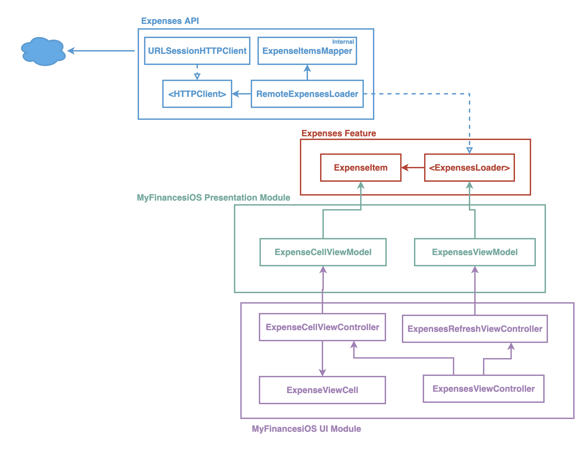

# MyFinances

App made with Swift and UIKit to practice various topics:

- TDD
- Clean code
- Modular architecture
- UI creation in iOS

The goal in the end is to have an iOS application that help me to do one simple task:
**Track my expenses**

As for the technical side, the application should be made with _decoupled_ modules, in other words, the system should be _extendable_, _flexible_ and _plataform agnostic_ to promove reusability of code.

---

### The Expense API response

The expected API object used for expenses retrieval will be:

```json
{
  {
  "0B8FB609-39D8-4E6E-8F57-0DCBEBD23850": {
    "amount": 99999.99,
    "created_at": "2021-03-20T19:00:00+00:00",
    "title": "move"
  },
  "1ACD6801-CDFA-4C11-9BA8-803A774EC49D": {
    "amount": 19.9,
    "created_at": "2021-03-19T00:11:00+00:00",
    "title": "mc germes"
  }
}
```

---

### Class diagram

The current application class diagram (will be updated):

